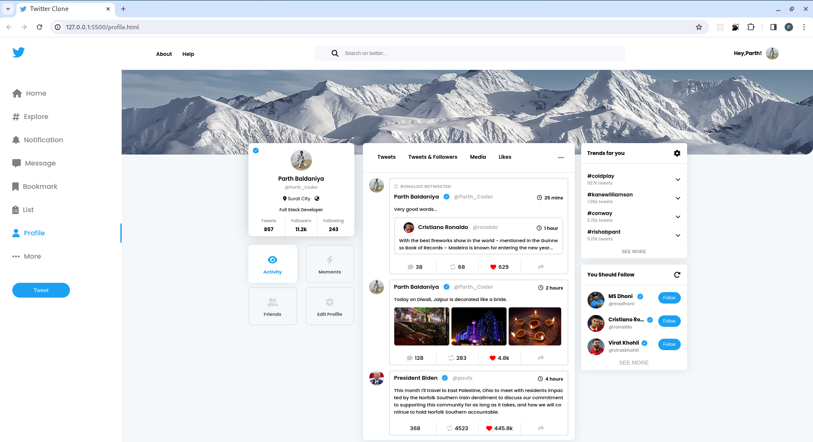

# Twitter Profile Page

## Overview
This project is a simple clone of the Twitter Profile page created using only HTML and CSS. It serves as a practice project for web development enthusiasts to understand the structure and styling of a modern social media profile page.

## Features
- Utilizes CSS flexbox for layout structure.
- CSS styling to mimic the appearance of Twitter's profile page.
- Clean and organized HTML structure.

## Screenshots

## How to Use
#### Clone the repository: git clone https://github.com/BaldaniyaParth/Twitter-Profile-Page.git
Open the index.html file in your preferred web browser.

## Contributing
Feel free to contribute to this project by opening issues or submitting pull requests. Your feedback and suggestions are highly appreciated.

